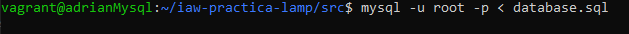

# Despliegue de CMS en arquitectura en 3 capas en Sitio no seguro

# **Índice**   
## 1. [Configuración Vagrant](#id1)
### 1.1. [Configuración de Aprovisionamiento](#id2)
## 2. [Configurador máquina Servidor NFS e Intérprete PHP-FPM](#id6)
### 2.1. [Configuración NFS](#id7)
### 2.2. [Configuración CMS](#id8)
### 2.3. [Configuración para ser Intérprete de PHP](#id9)
## 3. [Configurador Servidor MySQL](#id4)
## 4. [Configurador máquina Balanceador](#id5)
## 5. [Configuración Servidores Nginx](#id3)

# 1- Configuración Vagrant 
Para hacer el trabajo más sencillo, crearemos un entorno Vagrant con el cual, añadiendo un script de aprovisionamiento, ahorraremos trabajo a la hora de configurar cada una de las máquinas desde dentro.

## 1.1- Configuración de Aprovisionamiento
Los aprovisionamientos usados en cada una de las máquinas son diferentes dependiendo el uso de dicha máquina:

**Servidores Webs Nginx:**

**Servidor Mysql:**

**Balanceador:**

**Servidor NFS e Intérprete PHP-FPM:**

# 2- Configurador máquina Servidor NFS e Intérprete PHP-FPM 

## 2.1- Configuración NFS

Lo primero que haremos una vez dentro de nuestra máquina NFS e Intérprete PHP-FPM será crear el directorio donde montaremos nuestro servidor Web. Para ello usaremos el siguiente comando `sudo mkdir /var/www/seguro -p`

Una vez creemos la carpeta, cambiaremos su dueño y grupo, para que una vez compartida, pueda ser usada por Nginx. Para ello usamos el comando `sudo chown www-data:www-data /var/www/seguro`

Ahora pondremos el siguiente comando `sudo nano /etc/exports` y pondremos el siguiente contenido dentro:

Por último, reiniciaremos el servicio de NFS con el siguiente comando `sudo systemctl restart nfs-kernel-server`

## 2.2- Configuración CMS

Una vez el directorio que utilizaremos para almacenar nuestro CMS configurado para poder ser compartido con las máquinas indicadas, importaremos mediante `wget` el CMS que se usará, en este caso **JOOMLA**

Para ello, lo primero que haremos será instalar wget con el siguiente comando `sudo apt install wget`. Y como el archivo que descargaremos será un archivo ZIP, también instalaremos zip/unzip `sudo apt-get install zip unzip`

Una vez instalado, importaremos la versión 3.9.4 de Joomla: `sudo wget https://downloads.joomla.org/cms/joomla3/3-9-4/Joomla_3-9-4-Stable-Full_Package.zip`

Una vez descargado por completo, con el comando `sudo unzip Joomla_3-9-4-Stable-Full_Package.zip`

## 2.3- Configuración para ser Intérprete de PHP

Para poder ser interprete de PHP, debemos tener todos los paquetes de este mismo instalados necesarios para la perfecta ejecución de nuestro CMS.

Para ello, agregaremos el soporte de PHP y algunos paquetes necesarios para el sistema y nuestro CMS

`sudo apt install php-fpm php-mysql php-mbstring php-gettext php-zip php-curl php-intl php-gd php-xml php-bcmath php-ldap mlocate`

Con todo lo anterior, tan solo nos quedará configurar PHP-FPM. Para ello, accederemos a `sudo nano /etc/php/7.4/fpm/pool.d/www.conf` y le cambiaremos la direccion de escucha a la siguiente para que pueda recibir peticiones desde cualquier dirección:

En dicho archivo también cambiaremos el "listen.owner" y "listen.group" a www-data:

# 3- Configurador Servidor MySQL 

En el servidor Mysql, importaremos desde el repositorio Github dado en la práctica, una base de datos y la configuraremos para nuestra red. Para ello previamente instalaremos git.

Una vez instalado, importaremos desde `https://github.com/josejuansanchez/iaw-preactica-lamp.git` la base de datos.

En el archivo `mysql.conf`, cambiaremos la linea de "bind-address 172.0.0.1" por nuestra dirección IP del servidor Mysql.

Al haber instalado por aprovisionamiento MySQL, no tendremos contraseña de root. Para ello, pondremos el siguiente comando que nos permitirá configurar dichos parámetros sin tener que volver a instalar MySQL `sudo mysql_secure_installation`.

Con este comando, daremos una nueva contraseña al root en Mysql y desactivaremos algunas opciones extras para mayor seguridad de nuestra BBDD.

Antes de importar la base de datos a nuestro servidor, eliminaremos las tres ultimas líneas del archivo `iaw-practica-lamp/db/database.sql` para evitar posibles errores al crear un usuario.

Para finalizar los ajustes de nuestra base de datos, crearemos un usuario al cual le daremos permisos totales a la BD importada previamente.

Una vez completado el paso anterior, importaremos la base de datos a muestro MySQL con el siguiente comando `mysql -u root -p < iaw-practica-lamp/db/database.sql`

Una vez hecho esto, podemos eliminar el contenido de iaw-practica-lamp.

Esta base de datos seria la que seleccionariamos una vez instalemos el CMS por completo.

# 4- Configurador máquina Balanceador 

Lo primero que haremos una vez entremos a nuestro balanceador será eliminar nuestro sitio activo de Nginx, para ello utilizaremos el siguiente comando `sudo rm -rf /etc/nginx/sites-enabled/default`

Seguidamente, lo único que tendremos que hacer dentro de nuestro balanceador será la creación del archivo ***load-balancing.conf*** dentro de */etc/nginx/conf.d/* con el siguiente contenido:

Por último, reiniciaremos el servicio de Nginx para asegurar que los cambios se apliquen correctamente:

Una vez hecho esto, ya tendremos nuestro **Balanceador de Carga con Nginx** terminado.

# 5- Configuración Servidores Nginx 

***Los siguientes pasos se deberán realizar en ambas máquinas Nginx***

Lo primero que haremos una vez dentro de nuestra máquina Nginx será crear un directorio, en mi caso *seguro*.

Una vez lo tengamos creado, exportaremos la carpeta compartida por **NFS** con el siguiente comando: `sudo mount 192.168.11.100:/var/www/seguro /var/www/seguro`

Comprobaremos si el sitio a sido montado correctamente con el comando `df -h`

Una vez los preparativos terminados, iremos a la siguiente ruta */etc/nginx/sites-avalable/* y en ella, con el comando sudo nano editaremos el archivo default. En dicho archivo, cambiaremos la línea *root /var/www/html*; por *root /var/www/seguro*; y añadiremos index.php seguidamente de index un par de líneas mas abajo.

Dentro de ese mismo archivo, descomentaremos las siguientes líneas:

En esta última captura, la línea de *fastcgi_pass* borraremos la ruta por defecto que tiene y pondremos la dirección IP de nuestro Intérprete PHP.

Por último, solo nos quedará probar acceder a nuestro CMS.

